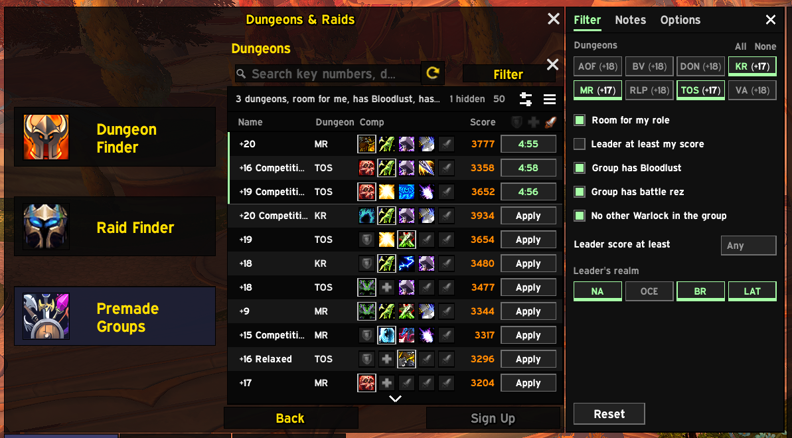
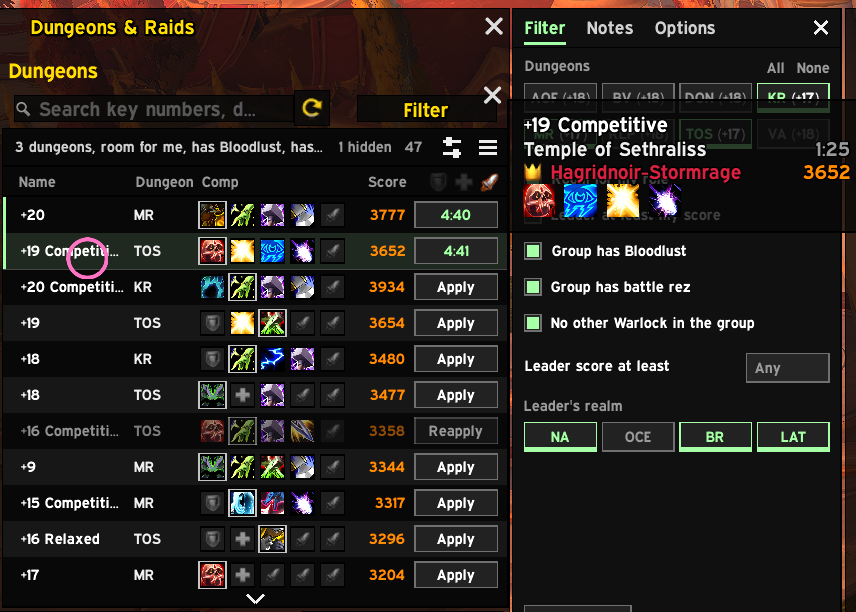
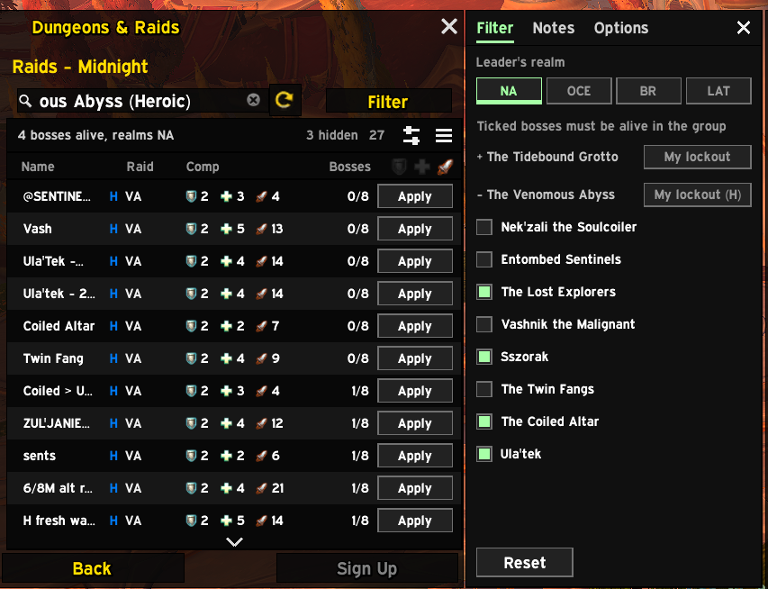
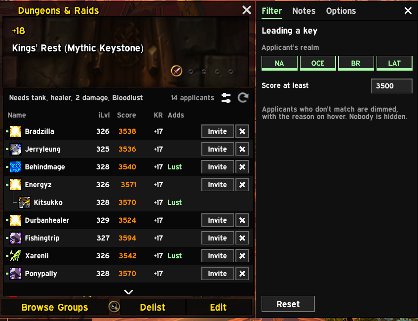
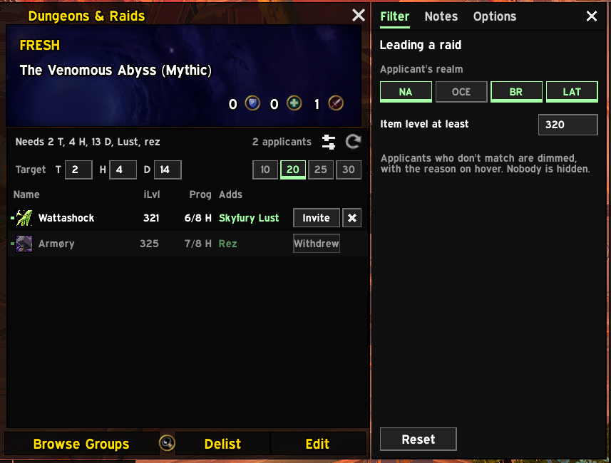
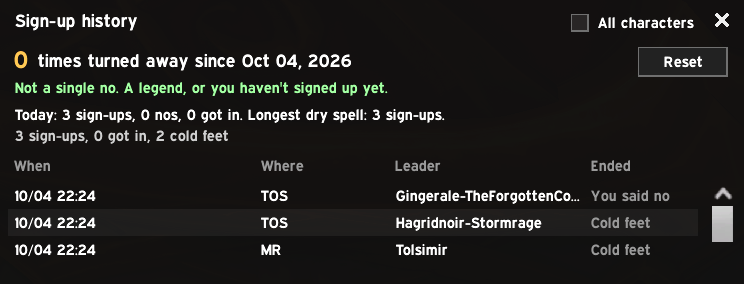

  

<h1 align="center">PickupGroup</h1>

  A faster premade-groups list that lives inside Blizzard's Group Finder. 
  <a href="https://www.curseforge.com/wow/addons/pickupgroup">CurseForge</a>
  ·
  <a href="https://github.com/TheWolfIsLoose/PickupGroup/releases">Releases</a>

Open Premade Groups and PickupGroup is already there: one compact list
that shows each group's comp at a glance, a saved filter for dungeons and
one for raids, and one click to sign up. Blizzard's search bar, refresh
and filter keep working underneath; PickupGroup just shows you more, faster.

  

## Features

- **Comps at a glance.** Every group's spec icons in a row, empty seats
  showing the role they need, and the leader marked. Raids show role
  counts and bosses down.
- **One filter per content type.** Room for my role, has Bloodlust, has
  battle rez, no other of my class, leader score floor, realm regions
  (NA, Oceanic, Brazil, Latin America) and, for raids, which bosses must
  still be alive. It sets Blizzard's own filter too, so the two always
  agree. The filter panel opens with the list, ready to tweak.
- **One-click sign-ups.** Click **Apply** to sign up at once.
  Shift-click to pick one of up to five saved notes first. Your sign-ups
  stay pinned at the top, with the time each has left, and survive a
  `/reload`.
- **Friends first.** Groups with a friend or guildmate in them go to the
  top of the list, marked.
- **Clean-up built in.** Hides listings that have been up for hours,
  adverts, carry offers and leaders you've blacklisted. Right-click any
  row to whisper, report, blacklist or hide its leader.
- **Leading a group.** Applicants show spec, item level, score and their
  best run in your key, with anyone below your bar dimmed (never hidden).
  Raid leaders set a target comp and see who rounds it out.
- **Ready when you are.** A chime when your dungeon group fills, and a
  teleport button for the dungeon once the party is complete.
- **A record of every rejection.** Sign-up history counts every time
  you've been turned away, your fastest "no" and your longest dry spell.
  `/pug stats` puts it in chat, for bragging rights.

  
  

  
  

  

## Commands

| Command | What it does |
| --- | --- |
| `/pug` (or `/pickupgroup`) | List commands |
| `/pug stats` | Your rejection record, ready to brag about |
| `/pug log` | Open the log (paste it into a bug report) |
| `/pug log clear` | Empty the log |
| `/pug debug` | Record extra detail in the log |

## Install

Retail (Midnight) only. No other addons required; with Raider.IO
installed, leaders also see applicants' raid progress.

Install from [CurseForge](https://www.curseforge.com/wow/addons/pickupgroup),
or unzip a [release](https://github.com/TheWolfIsLoose/PickupGroup/releases)
into `Interface/AddOns/`. Found a bug? Open an
[issue](https://github.com/TheWolfIsLoose/PickupGroup/issues) with your
`/pug log`.

## Credits

The fill chime is The Cyclist from
[SharedMedia: Tones](https://www.curseforge.com/wow/addons/sharedmedia-tones).
Font: Barlow Semi Condensed (SIL Open Font License).

Built with heavy AI assistance; every change is reviewed and tested in-game
before release. Developers: see [Dev/](Dev/) for the roadmap, history and
release process.

## License

MIT. See [LICENSE](LICENSE).
